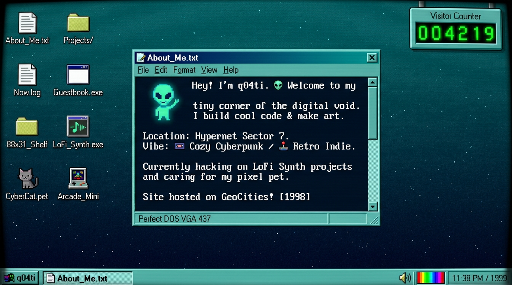

# q04ti's personal website

> "every portfolio looks like the exact same generic template so i built a retro desktop os instead"



## live link
- site: [https://q04ti.github.io/q04tiweb](https://q04ti.github.io/q04tiweb)
- repo: [https://github.com/q04ti/q04tiweb](https://github.com/q04ti/q04tiweb)

---

## whats on here

double click or tap the desktop icons:

- About_Me.txt: who i am (q04ti), what i build, and random things i like.
- Projects/: stuff i built for fun (PocketSynth, TerminalNotes, PixelGarden).
- Now.log: a /now page inspired by nownownow.com showing what im up to right now, what manga im reading, and music on repeat.
- Guestbook.exe: a board where visitors can pick a stamp sticker and leave a note. saves in localStorage.
- 88x31_Shelf.html: classic 88x31 pixel buttons, including a button for my site with an html embed code button.
- LoFi_Synth.exe: procedural 8-bit chiptune audio generator with a visualizer. uses web audio api oscillators so there are no audio files to load.
- CyberCat.pet: mochi the desk cat. you can pet him, feed him fish, and see his mood change.
- Arcade_Mini: playable brick breaker canvas game with sound effects and high scores.
- Terminal.sh: interactive terminal with commands like help, about, now, matrix, neofetch, fortune, and secret files.
- themes & scanlines: switcher for cyber dark, win95, amber crt, gameboy green, and vaporwave themes, plus a crt scanline toggle.
- visitor counter: retro counter in the corner tracking visits.

---

## how i built this

- plain html, css, and javascript.
- zero frameworks. no react, no tailwind, no heavy dependencies. loads instantly.
- all sound effects and chiptune tracks are synthesized in real time using the browser web audio api.
- local storage so guestbook notes, high scores, themes, and cat petting counts save between visits.

---

## the part im proudest of

the procedural chiptune synth and the draggable window manager in `script.js`. 
no audio files were used at all. it is just pure javascript generating square waves, basslines, and percussion ticks directly in the browser.

---

## secrets & easter eggs

1. gamer code: try typing the classic konami code on your keyboard anywhere on the page (up up down down left right left right b a).
2. terminal: open Terminal.sh and type `cat secret.txt` or `matrix`.
3. cat: pet mochi a bunch of times.

---

## run it locally

open `index.html` in your browser or run:
```bash
python -m http.server 8000
```
then open `http://localhost:8000`.

---

*built by q04ti.*
